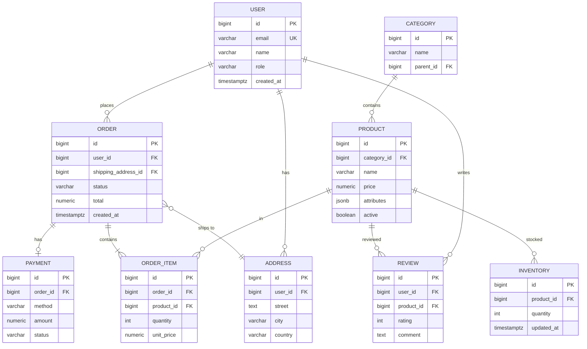

# E-Commerce ER Diagram

```mermaid
erDiagram
    USER ||--o{ ORDER : "places"
    USER ||--o{ REVIEW : "writes"
    USER ||--o{ ADDRESS : "has"
    CATEGORY ||--o{ PRODUCT : "contains"
    PRODUCT ||--o{ ORDER_ITEM : "in"
    PRODUCT ||--o{ REVIEW : "reviewed"
    PRODUCT ||--o{ INVENTORY : "stocked"
    ORDER ||--|{ ORDER_ITEM : "contains"
    ORDER ||--o| PAYMENT : "has"
    ORDER }o--|| ADDRESS : "ships to"

    USER {
        bigint id PK
        varchar email UK
        varchar name
        varchar role
        timestamptz created_at
    }

    CATEGORY {
        bigint id PK
        varchar name
        bigint parent_id FK
    }

    PRODUCT {
        bigint id PK
        bigint category_id FK
        varchar name
        numeric price
        jsonb attributes
        boolean active
    }

    ORDER {
        bigint id PK
        bigint user_id FK
        bigint shipping_address_id FK
        varchar status
        numeric total
        timestamptz created_at
    }

    ORDER_ITEM {
        bigint id PK
        bigint order_id FK
        bigint product_id FK
        int quantity
        numeric unit_price
    }

    PAYMENT {
        bigint id PK
        bigint order_id FK
        varchar method
        numeric amount
        varchar status
    }

    INVENTORY {
        bigint id PK
        bigint product_id FK
        int quantity
        timestamptz updated_at
    }

    REVIEW {
        bigint id PK
        bigint user_id FK
        bigint product_id FK
        int rating
        text comment
    }

    ADDRESS {
        bigint id PK
        bigint user_id FK
        text street
        varchar city
        varchar country
    }
```
