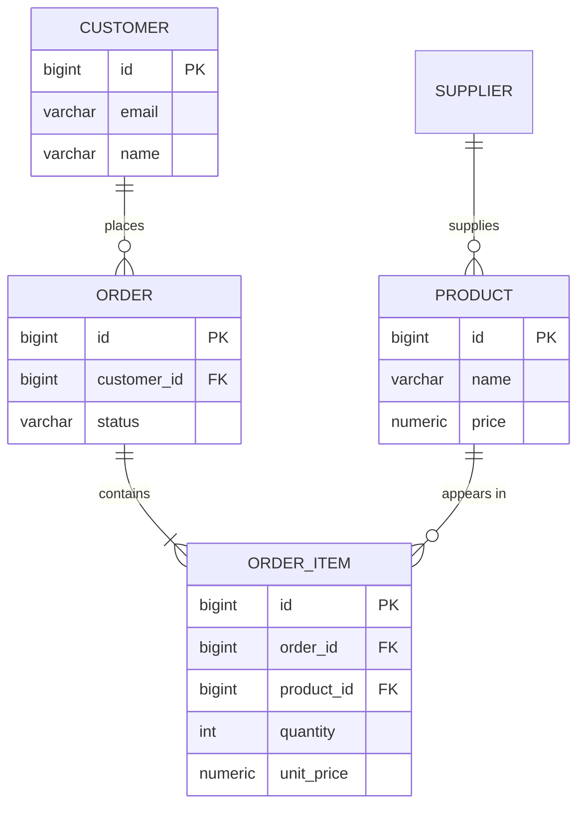

# BOOK 1 – Chapter 2: Modeling a System

---

## 1. Core Concept Explanation (Deep Technical Version)

### The Gap Between User Intent and Relational Schema

Users have mental models of their domain—vague, overlapping, and often contradictory. A database schema is a formal, rigid structure. The **Entity-Relationship (ER) model** (Chen, 1976) bridges this gap: it provides a conceptual layer that captures user intent in a form that can be systematically translated into relations (tables).

The ER model predates widespread relational implementations. It was designed to be **implementation-agnostic**—you can validate the model with stakeholders before committing to a specific DBMS or physical design.

### Four Pillars of the ER Model

**Entities** are distinct things the user wants to track. An **entity class** (e.g., EMPLOYEE) is a type; an **entity instance** (e.g., Duke Kahanamoku) is a specific occurrence. In relational terms, an entity class maps to a table; an instance maps to a row.

**Attributes** are properties of entities. They become columns. Not every conceivable attribute belongs in the model—only those the user needs. Including "favorite surfboard brand" in EMPLOYEE adds noise and storage cost unless the business requires it.

**Identifiers** uniquely distinguish instances. A **simple identifier** is a single attribute (e.g., EmpID). A **composite identifier** combines multiple attributes (e.g., FirstName + LastName + BirthDate). Identifiers map to primary keys. Non-unique attributes (e.g., FirstName alone) cannot serve as identifiers.

**Relationships** connect entities. A **binary relationship** links two entity classes. **Degree-three** (ternary) relationships link three—e.g., COMPOSER, SONG, LYRICIST. Higher-degree relationships are rare and often indicate a design that should be decomposed into binary relationships.

### Cardinality: Maximum and Minimum

**Maximum cardinality** defines the upper bound on each side of a relationship:

- **1:1** (one-to-one): Person ↔ License. Each person has at most one license; each license belongs to at most one person.
- **1:N** (one-to-many): Person → Tickets. Each person can have many tickets; each ticket belongs to one person.
- **N:M** (many-to-many): Student ↔ Course. Students take many courses; courses have many students.

**Minimum cardinality** defines whether participation is **mandatory** (at least one) or **optional** (zero or more). A person may exist without a license (optional on LICENSE side); a license must belong to a person (mandatory on PERSON side). Minimum cardinality drives NULLability of foreign keys and CHECK constraints.

### Strong vs Weak Entities

A **strong entity** exists independently. CUSTOMER, PRODUCT, EMPLOYEE can exist without related rows in other tables.

A **weak entity** is existence-dependent on another entity. A LICENSE cannot exist without a PERSON. In diagrams, weak entities use rounded corners.

An **ID-dependent entity** is a weak entity whose identifier includes the parent's identifier. SEAT is ID-dependent on FLIGHT: seat "23-A" is ambiguous without flight ID. The full key is (flight_id, seat_number). This maps to a composite primary key where the FK is part of the PK.

### Supertype and Subtype (Inheritance)

When entity classes share attributes but also have distinct attributes, use **supertype/subtype**. COMMUNITY is a supertype; STUDENT, FACULTY, STAFF are subtypes. Shared attributes (name, address, email) live in the supertype; specific attributes (GPA, academic rank, job title) live in subtypes.

**Implementation options** in relational databases:

1. **Single table inheritance (STI)**: One table with a type discriminator column; subtype-specific columns nullable.
2. **Class table inheritance (CTI)**: Supertype table + one table per subtype, 1:1 with supertype.
3. **Concrete table inheritance**: Separate tables per subtype, duplicating shared columns.

PostgreSQL has no native inheritance for tables in the OO sense; you implement via schema design. The ER model guides which option fits.

### Many-to-Many Resolution

Relational tables are two-dimensional; N:M cannot be represented directly. The standard resolution: introduce an **associative entity** (junction table). STUDENT ↔ COURSE becomes STUDENT, COURSE, and ENROLLMENT (student_id, course_id, grade, semester). ENROLLMENT has two FKs; its PK is often (student_id, course_id) or a surrogate plus unique constraint.

---

## 2. Why This Matters in Production

### Real-World System Example

A medical clinic tracks employees, patients, examinations, tests, and results. Without a formal model:

- Developers guess at tables and relationships.
- "Can a patient have multiple doctors?"—unclear. "Can a test result go to multiple doctors?"—unclear.
- Schema changes cascade unpredictably.

With an ER model:

- Stakeholders validate entities and relationships before code is written.
- Business rules (e.g., "dependents are associated with only one employee for insurance") are explicit.
- Translation to tables is mechanical; fewer surprises.

### Scalability Impact

- **Poor modeling**: Redundant tables, missing relationships, N:M stored as comma-separated values. Queries become complex; migrations are risky.
- **Good modeling**: Clear boundaries, normalized structure. Adding features (e.g., new entity type) follows established patterns.

### Performance Impact

- **Over-modeling**: Too many subtypes, excessive normalization. Joins multiply; query plans degrade.
- **Under-modeling**: Denormalized "god tables." Update anomalies, lock contention.
- **Balanced modeling**: Normalize for integrity; denormalize only where profiling justifies it.

### Data Integrity Implications

- **Minimum cardinality = 0**: FK can be NULL. Application must handle "no related row."
- **Minimum cardinality = 1**: FK NOT NULL. Ensures every order has a customer.
- **Business rules in model**: "A team must have at least 5 players" → CHECK constraint or application logic. Capturing it in the ER diagram ensures it isn't forgotten.

### Production Failure Scenario

**Case: E-commerce checkout.** The ER model showed ORDER → CUSTOMER as 1:N with mandatory customer. Implementation allowed NULL customer_id "for guest checkout." Result: reports double-counted (guest orders excluded in some queries, included in others). Fix: Add GUEST_CHECKOUT entity or make the model explicit—either customer_id is mandatory or there is a separate path for guests. The ER model would have forced this decision upfront.

---

## 3. PostgreSQL Implementation

### Entity to Table

```sql
-- Entity: CUSTOMER
-- Attributes: id, email, name, created_at
CREATE TABLE customers (
  id         BIGSERIAL PRIMARY KEY,
  email      VARCHAR(255) NOT NULL UNIQUE,
  name       VARCHAR(100),
  created_at TIMESTAMPTZ DEFAULT CURRENT_TIMESTAMP
);
```

### 1:1 Relationship (Person ↔ License)

```sql
CREATE TABLE persons (
  id   BIGSERIAL PRIMARY KEY,
  name VARCHAR(100) NOT NULL
);

CREATE TABLE licenses (
  id         BIGSERIAL PRIMARY KEY,
  person_id  BIGINT NOT NULL UNIQUE REFERENCES persons(id),  -- UNIQUE enforces 1:1
  number     VARCHAR(50) NOT NULL,
  expires_at DATE NOT NULL
);
```

### 1:N Relationship (Customer → Orders)

```sql
CREATE TABLE orders (
  id          BIGSERIAL PRIMARY KEY,
  customer_id BIGINT NOT NULL REFERENCES customers(id),  -- NOT NULL = mandatory
  status      VARCHAR(20) NOT NULL DEFAULT 'pending',
  total       NUMERIC(10, 2) DEFAULT 0
);

CREATE INDEX idx_orders_customer ON orders(customer_id);
```

### N:M Resolution (Products ↔ Orders via Order Items)

```sql
CREATE TABLE order_items (
  id         BIGSERIAL PRIMARY KEY,
  order_id   BIGINT NOT NULL REFERENCES orders(id),
  product_id BIGINT NOT NULL REFERENCES products(id),
  quantity   INTEGER NOT NULL CHECK (quantity > 0),
  unit_price NUMERIC(10, 2) NOT NULL,
  UNIQUE (order_id, product_id)
);
```

### Supertype/Subtype (Class Table Inheritance)

```sql
CREATE TABLE employees (
  id         BIGSERIAL PRIMARY KEY,
  name       VARCHAR(100) NOT NULL,
  hire_date  DATE NOT NULL
);

CREATE TABLE doctors (
  id            BIGINT PRIMARY KEY REFERENCES employees(id) ON DELETE CASCADE,
  license_num   VARCHAR(50) NOT NULL,
  specialty     VARCHAR(100)
);

CREATE TABLE nurses (
  id            BIGINT PRIMARY KEY REFERENCES employees(id) ON DELETE CASCADE,
  license_num   VARCHAR(50) NOT NULL
);
```

### ID-Dependent Entity (Seat on Flight)

```sql
CREATE TABLE flights (
  id        BIGSERIAL PRIMARY KEY,
  number    VARCHAR(20) NOT NULL,
  dep_date  DATE NOT NULL
);

CREATE TABLE seats (
  flight_id   BIGINT NOT NULL REFERENCES flights(id) ON DELETE CASCADE,
  seat_number VARCHAR(10) NOT NULL,
  PRIMARY KEY (flight_id, seat_number)
);
```

### Mermaid ER Diagram (Gentoo Joyce Retail)



---

## 4. Common Developer Mistakes

### Mistake 1: Skipping the Model

Jumping straight to CREATE TABLE. Without an ER model, you miss relationships (e.g., order_items), misjudge cardinality, and embed business rules in code instead of schema.

### Mistake 2: Treating N:M as Two Columns

Storing "products in order" as `product_ids VARCHAR` (e.g., "1,2,3"). Violates 1NF, prevents indexing, makes aggregation impossible. Correct: junction table.

### Mistake 3: Ignoring Minimum Cardinality

Making every FK nullable "for flexibility." If the business says "every order must have a customer," use NOT NULL. Optional participation (e.g., order can exist before shipping_address is set) should be explicit.

### Mistake 4: Overusing Subtypes

Creating STUDENT, FACULTY, STAFF as separate tables with no shared base when they share 90% of attributes. Result: repeated schema, complex UNIONs. Use supertype/subtype when there is genuine divergence.

### Mistake 5: Confusing Attributes with Entities

"Doctor's license" as an entity vs attribute. If it's 1:1 with doctor and has no independent lifecycle, it's an attribute. If licenses have their own history, renewals, or are shared (rare), then entity.

### Mistake 6: No Stakeholder Sign-Off

Building from assumptions. Get a Statement of Requirements with stakeholder signatures. Protects against scope creep and "I thought you meant X."

---

## 5. Interview Deep-Dive Section

### Conceptual Questions

**Q: What is the difference between an entity class and an entity instance?**  
A: Entity class is the type (e.g., EMPLOYEE); instance is a specific occurrence (e.g., Duke Kahanamoku). Maps to table vs row.

**Q: How do you resolve a many-to-many relationship in a relational database?**  
A: Introduce a junction (associative) table with FKs to both sides. The junction can have its own attributes (e.g., enrollment date, grade). PK is often composite (both FKs) or surrogate + unique constraint.

**Q: What is a weak entity?**  
A: An entity that cannot exist without another entity. E.g., LICENSE depends on PERSON. Implemented with NOT NULL FK and often ON DELETE CASCADE.

**Q: What is minimum cardinality and why does it matter?**  
A: The minimum number of related instances (0 or 1). Optional (0) → FK can be NULL. Mandatory (1) → FK NOT NULL. Drives schema and application logic.

### Scenario-Based Questions

**Q: You have EMPLOYEE and DEPENDENT. A dependent can belong to only one employee, but for insurance, if both spouses work, dependents are assigned to one. How do you model this?**  
A: EMPLOYEE 1:N DEPENDENT. DEPENDENT has employee_id FK (NOT NULL). Business rule "assigned to one" is enforced by the 1:N structure. The rule "only one employee" is a business policy, not a schema constraint—enforce in application or trigger.

**Q: How would you model STUDENT, COURSE, and ENROLLMENT with a grade?**  
A: ENROLLMENT (student_id, course_id, grade). PK (student_id, course_id) or add id as surrogate. Grade is an attribute of the relationship, not of student or course alone.

### Optimization Questions

**Q: When would you use single-table vs class-table inheritance?**  
A: STI: Few subtypes, few subtype-specific columns, simple queries. CTI: Many subtypes, many specific columns, need to query subtypes independently. STI avoids JOINs but has sparse columns; CTI is normalized but requires JOINs.

---

## 6. Advanced Engineering Notes

### Internal Behavior

- **ER to relational mapping**: Each strong entity → table. Each 1:N → FK on the "many" side. Each N:M → junction table. Weak/ID-dependent → table with composite or FK-in-PK.
- **Cardinality constraints**: Maximum cardinality N or M → no schema enforcement (application or trigger). Minimum 1 → NOT NULL. Minimum 0 → nullable FK.

### Tradeoffs

| Approach | Pros | Cons |
|----------|------|------|
| ER first, then SQL | Validated with users; fewer rework | Extra step; some see as overhead |
| SQL first | Fast to prototype | Easy to bake in wrong assumptions |
| ER + code gen | Automated translation | Rigid; may not fit all cases |

### Design Alternatives

- **Document model (NoSQL)**: Embed related data (e.g., order with line items as array). Good for read-heavy, flexible schema. Bad for integrity, ad-hoc joins.
- **Graph model**: Entities as nodes, relationships as edges. Good for traversals (e.g., "friends of friends"). Overkill for simple CRUD.

---

## 7. Mini Practical Exercise

### Hands-On SQL Task

Model a library: MEMBER, BOOK, LOAN. A member can have many loans; a book can be in many loans (over time). Each loan has one member and one book, plus due_date and returned_date.

1. Draw the ER diagram (Mermaid or paper).
2. Identify cardinalities (MEMBER 1:N LOAN, BOOK 1:N LOAN).
3. Create tables with appropriate FKs and constraints.

```sql
CREATE TABLE members (
  id   BIGSERIAL PRIMARY KEY,
  name VARCHAR(100) NOT NULL,
  email VARCHAR(255) NOT NULL UNIQUE
);

CREATE TABLE books (
  id     BIGSERIAL PRIMARY KEY,
  title  VARCHAR(200) NOT NULL,
  isbn   VARCHAR(20) UNIQUE
);

CREATE TABLE loans (
  id           BIGSERIAL PRIMARY KEY,
  member_id    BIGINT NOT NULL REFERENCES members(id),
  book_id      BIGINT NOT NULL REFERENCES books(id),
  due_date     DATE NOT NULL,
  returned_date DATE
);
```

### Schema Modification Task

Add a BUSINESS_RULE: "A member cannot have more than 5 active loans (returned_date IS NULL)." Implement via CHECK constraint (requires subquery—PostgreSQL supports it) or trigger.

```sql
-- Trigger approach (CHECK with subquery not always supported)
CREATE OR REPLACE FUNCTION check_active_loans()
RETURNS TRIGGER AS $$
BEGIN
  IF (SELECT COUNT(*) FROM loans WHERE member_id = NEW.member_id AND returned_date IS NULL) >= 5
  THEN
    RAISE EXCEPTION 'Member cannot have more than 5 active loans';
  END IF;
  RETURN NEW;
END;
$$ LANGUAGE plpgsql;

CREATE TRIGGER trg_check_active_loans
  BEFORE INSERT ON loans
  FOR EACH ROW EXECUTE FUNCTION check_active_loans();
```

### Query Challenge

List all members who have never borrowed a book. Requires LEFT JOIN and NULL check, or NOT EXISTS. Tests understanding of optional participation.

```sql
SELECT m.* FROM members m
LEFT JOIN loans l ON m.id = l.member_id
WHERE l.id IS NULL;
```

---

## 8. Summary in 10 Bullet Points

1. **ER model bridges** user mental models and relational schema; validate before implementing.
2. **Entities, attributes, identifiers, relationships** are the four pillars; map to tables, columns, PKs, FKs.
3. **Maximum cardinality** (1:1, 1:N, N:M) determines FK placement and junction tables.
4. **Minimum cardinality** (optional vs mandatory) determines NULLability of FKs.
5. **Weak entities** depend on another for existence; **ID-dependent** entities include parent ID in their key.
6. **Supertype/subtype** models inheritance; implement via STI, CTI, or concrete tables.
7. **N:M relationships** require a junction table; the junction can hold relationship attributes.
8. **Stakeholder triage**: Mandatory, significant, optional—get sign-off on scope.
9. **Business rules** belong in the model; capture them in interviews and reflect in constraints.
10. **Iterate**: ER design is iterative; validate with users, then translate to SQL.
