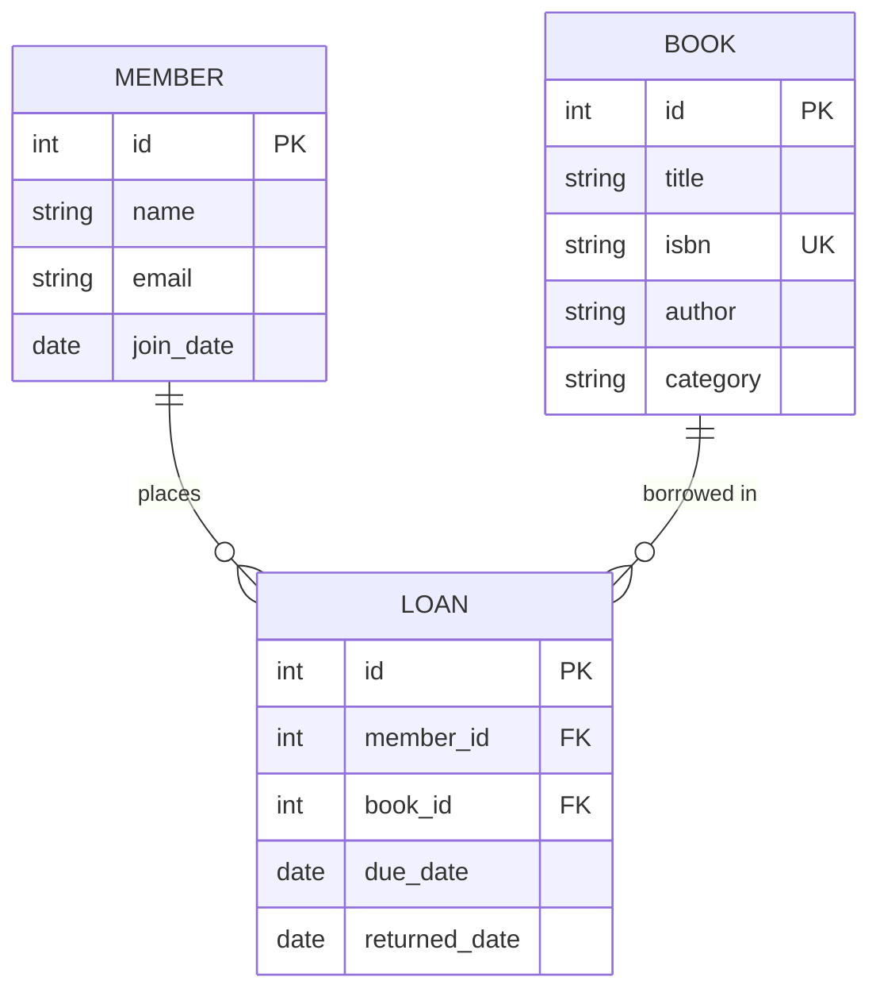

# Lab 2: ER Modeling Exercise

## Objectives

- Practice translating requirements into an ER model
- Identify entities, relationships, and attributes
- Create a Mermaid ER diagram

## Scenario: Library System

A library needs to track:
- Books (title, ISBN, author, category)
- Members (name, email, join date)
- Loans (which member borrowed which book, when, due date)

## Tasks

### 1. Identify Entities

List the main entities. For each, note:
- Primary key (natural or surrogate?)
- Attributes

### 2. Identify Relationships

- What is the relationship between Member and Loan?
- What is the relationship between Book and Loan?
- Can a member have multiple active loans?

### 3. Draw the Diagram

Use Mermaid or draw.io. Example structure:

### 4. Answer Design Questions

- Should we store author in the Book table or a separate Authors table? Why?
- How would you handle a book with multiple authors?
- What constraint ensures a member can't have two active loans of the same book?

## Solution Hints

- **Author**: If one author per book, keep in Book. If many-to-many: `books`, `authors`, `book_authors` junction.
- **Multiple active loans**: Same book can be in multiple loans over time, but only one "active" (returned_date IS NULL) per book at a time.
