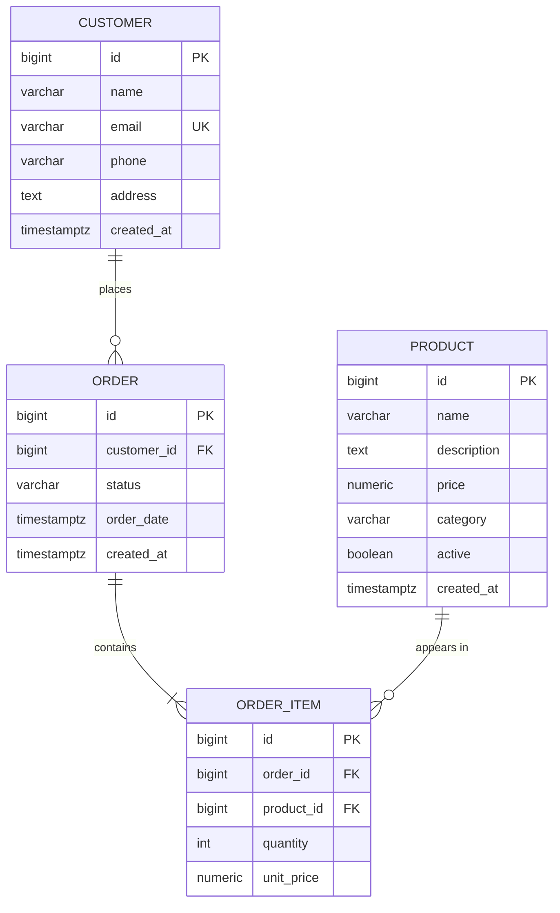

# Online Retail System — ER Diagram

## Entity-Relationship Diagram (Mermaid)

## Relationship Summary

| From | To | Cardinality | Description |
|------|-----|-------------|-------------|
| Customer | Order | 1:N | One customer places many orders |
| Order | Order Item | 1:N | One order contains many line items |
| Product | Order Item | 1:N | One product can appear in many order items |

## Key Design Decisions

- **Surrogate keys**: All tables use `id BIGSERIAL` for stable, simple joins
- **Order price snapshot**: `order_items.unit_price` stores price at order time (products.price can change)
- **Customer email**: UNIQUE for login/identity
- **Product active**: Soft delete — keep history, hide from catalog
