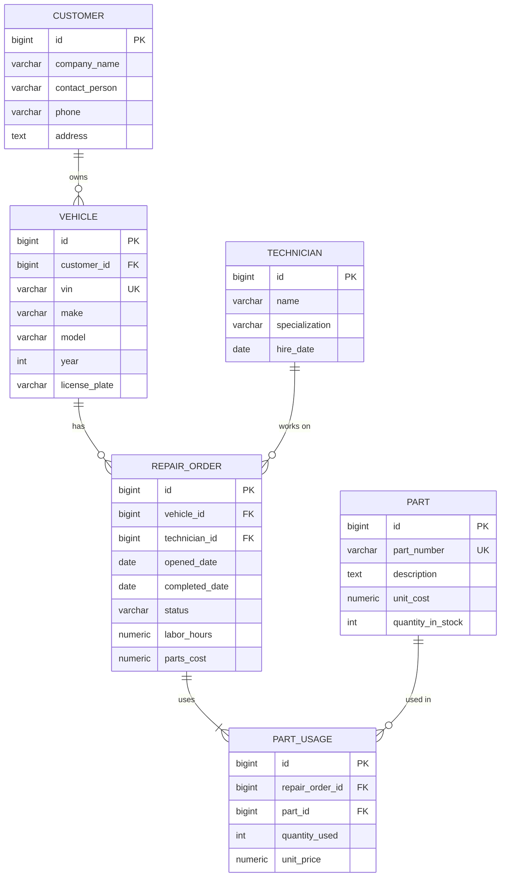

# Fleet Repair System — ER Diagram

## Mermaid Diagram

## Relationships

| From | To | Cardinality |
|------|-----|-------------|
| Customer | Vehicle | 1:N |
| Vehicle | Repair Order | 1:N |
| Technician | Repair Order | 1:N |
| Repair Order | Part Usage | 1:N |
| Part | Part Usage | 1:N |

## Normalization Notes

- **3NF**: No transitive dependencies. Part usage stores unit_price at time of use (snapshot).
- **Junction**: Part Usage resolves N:M between Repair Order and Part.
